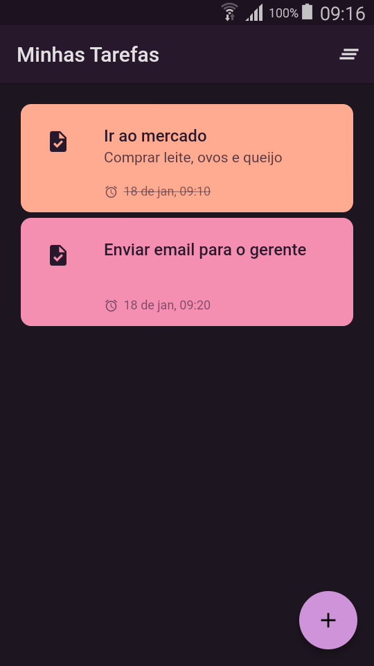
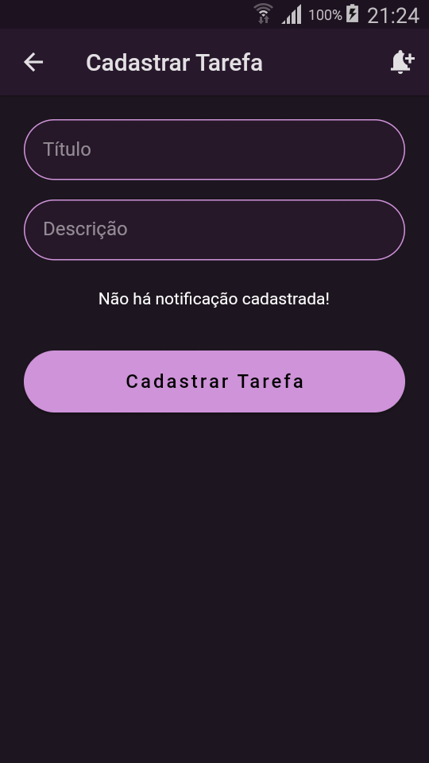
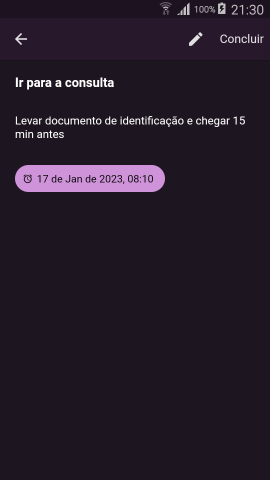
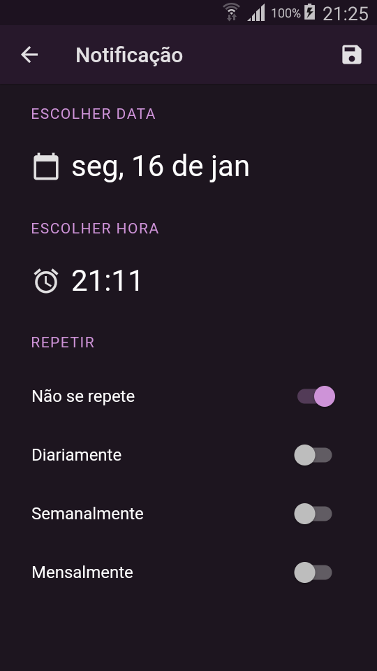
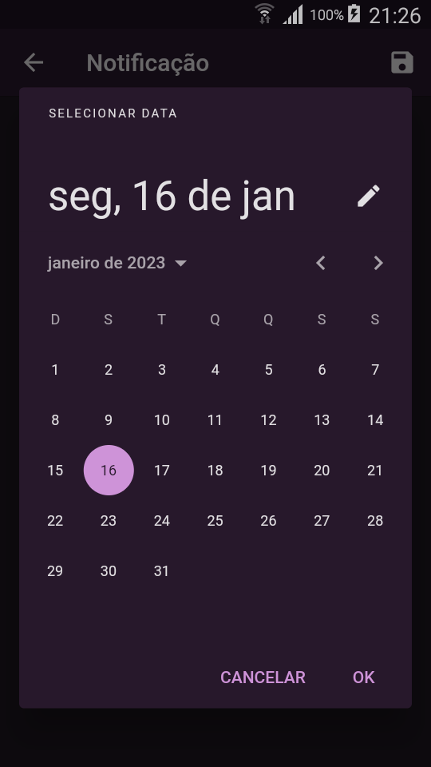
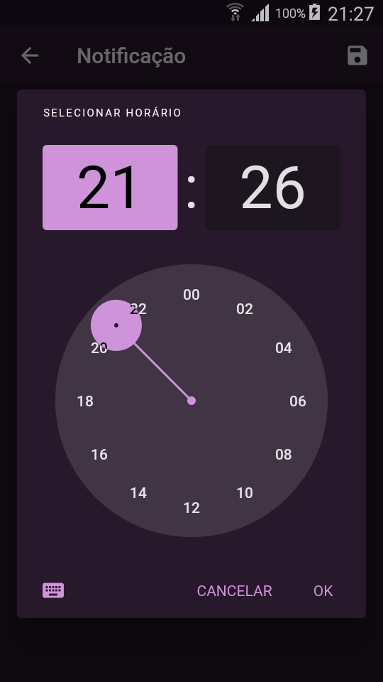

# Flutter MVC Task App with Provider and Sqlite
Design of a task app that allows scheduling and receiving notifications

## Project Status
Concluded

## Features

This Project contains the following features:
- Add Task
- Update Task
- Delete Task
- Delete All Task
- Schedule Notification
- Schedule Daily Notification
- Schedule Weekly Notification
- Schedule Monthly Notification

## Technologies
The following technologies were used in this project: 

> See the file [pubspec.yaml](pubspec.yaml)

- [provider](https://pub.dev/packages/provider)
- [flutter_local_notifications](https://pub.dev/packages/flutter_local_notifications)
- [flutter_native_timezone](https://pub.dev/packages/flutter_native_timezone)
- [timezone](https://pub.dev/packages/timezone)
- [dartz](https://pub.dev/packages/dartz)
- [equatable](https://pub.dev/packages/equatable)
- [get_it](https://pub.dev/packages/get_it)
- [sqflite](https://pub.dev/packages/sqflite)
- [path](https://pub.dev/packages/path)
- [rxdart](https://pub.dev/packages/rxdart)
- [intl](https://pub.dev/packages/intl)

## Knowledge of Flutter/Dart
The following Flutter/Dart knowledge was applied in this project:
- Navigation 1.0
  - Generate Route
  - Arguments between routes
  - Named Routes
- Stream
- Widgets Animation
- Page Transition
- Theme
- Custom Widgets
- Provider / ChangeNotifier
- Local Notification
- Database integration

## Design Patterns
The following design pattern were used in this project:

- MVC (Model-View-Controller)
- Repository
- Adapter

## App Images

## App Videos

